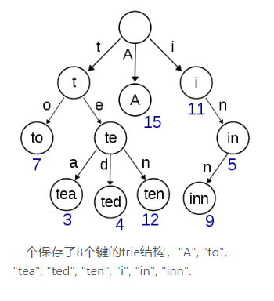

参考视频：<https://www.bilibili.com/video/BV13g41157hK?p=10>

## 前缀树

`["abc","bck","abd","ace"]`，可用前缀树来统计这些单词中，前缀为`ab`的单词有多少。

下面是个图例：

## 字典序

"bc"和"bca"比较字典序，"bc"补零为"bc0"，然后"bc0"与"bca"数值比较，得到"bc"字典序更小

## 贪心算法

贪心算法代码比较好写

从局部最优到全局最优的证明，在实战中都是凭直觉，因为没时间证明。

不用数学证明的方法，而是用对数器的方法(实现一个最暴力的解法，如全排列然后枚举)

## 贪心在字典序问题中的应用-使用sort和compare函数

问题描述：若干字符串，如`["abc","bck","abd","ace"]`，你能决定他们的放置顺序，
问如何放置可以使最终的字符串字典序最小

验证一下几个贪心策略是否可行：

1. 字典序小的字符串优先放在前面，此策略容易找出反例，故该策略不行

## 贪心策略问题-哈夫曼编码问题-使用堆解决

## 贪心策略最常用的技巧

堆和排序是最常用的两个技巧

## 贪心策略如何准备

写些对数器和模板，多多思考一些贪心策略

对数器(暴力枚举)的代码好像很难写，但写多了其实不会

## 大根堆和小根堆的应用

问题描述：一个数据流中，随时可以取得中位数

参考视频：<https://www.bilibili.com/video/BV13g41157hK?p=10> (2:17:45左右)

解决思路：

1. 第一个数进入大根堆
2. 后续的数，若该数小于大根堆堆顶，则进入大根堆，否则进入小根堆
3. 看看大根堆和小根堆的元素数，如果一个堆比另一个堆元素数多到了2，就弹出元素到另一个堆中
