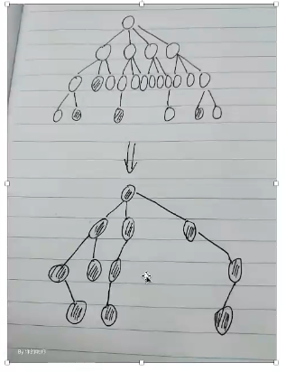

## 2022年算法对面试的重要性以及难度

参考视频：<https://www.bilibili.com/video/BV12Y4y1r7Q5?p=1>

国内的面试的算法内容简单；国外面试看中算法，面试中的算法会很难

国内的笔试很难，都是acm大佬出的

## 被问得多的算法知识点

参考视频：<https://www.bilibili.com/video/BV12Y4y1r7Q5?p=2>

1. 位运算
2. 对数器
3. 比较器
4. 二分法及其拓展
5. 递归到动态规划

### 常见算法

斐波那契数列，KMP，蓄水池算法，根据题目的数据量猜解法技巧

## 返回处理后的树的头节点

题目描述：处理后只留下黑色节点及其路径上的节点，如图：

### 背后思想是掌握二叉数的递归套路
